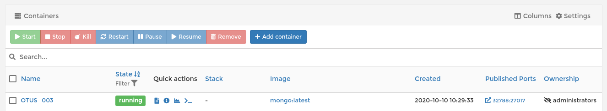
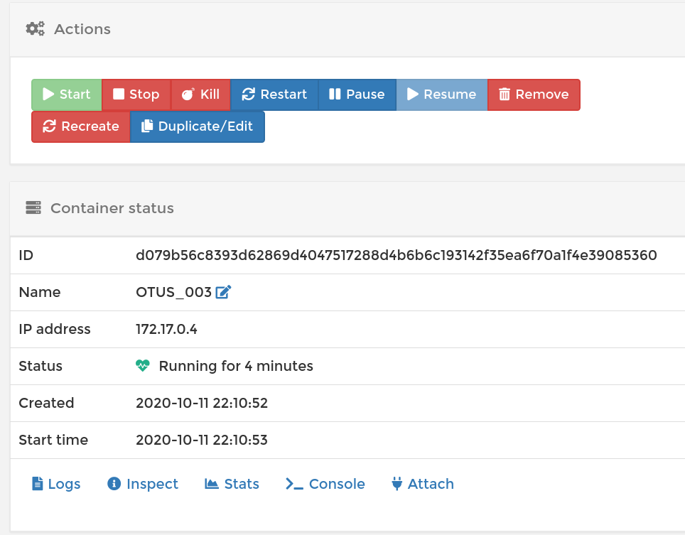
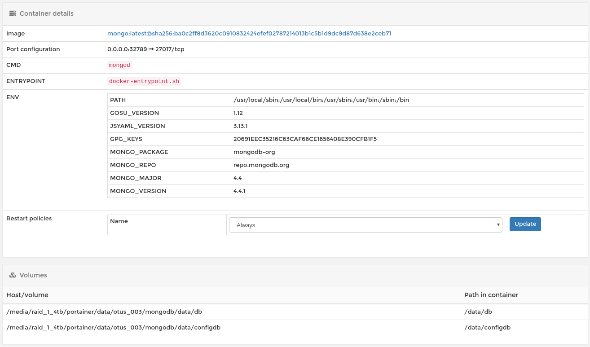

# MongoDB - основы

Занятие от 2020.10.10

__Цель:__ В результате выполнения ДЗ вы научитесь разворачивать MongoDB, заполнять данными и делать запросы.

__Необходимо:__
- установить MongoDB одним из способов: ВМ, докер;
- заполнить данными;
- написать несколько запросов на выборку и обновление данных

Сдача ДЗ осуществляется в виде миниотчета.

__Дпоплнительно:__
* создать индексы и сравнить производительность.

__Критерии оценки:__
- задание выполнено - 5 баллов
- предложено красивое решение - плюс 1 балл
- предложено рабочее решение, но не устранены недостатки, указанные преподавателем - минус 1 балл
- плюс 3 балла за задание со *

__Рекомендуем сдать до:__ 20.10.2020

## Решение 

### Установка хранилища

MongoDB было развернуто на машине в локальной сети с использованием Docker-контейнеризации и оболочки (Portainer.io)[https://www.portainer.io]. 
 




Был поправлен шаблон на предмет мапипинга данных (директорий) контейнера на реальные физические.



### Запонение хранилища данными

Я в поисках данных, достаточных для изучения возможностей MongoDB, остановился на наборе данных NASA ("Earth Meteorite Landings")[https://data.nasa.gov/resource/y77d-th95.json] (1000 строк со сведениями об упавших на Землю метеоритах,
([y77d-th95.json](003_MONGODB.files/y77d-th95.json)) из репозитория [awesome-json-datasets](https://github.com/jdorfman/awesome-json-datasets).

_Замечание_: нашел более полные (45.7K) (сведения)[https://data.nasa.gov/Space-Science/Meteorite-Landings/gh4g-9sfh], но экспорт в JSON через API дает только 1000 записей (непонятно), надо перелопатить [полные данные](https://data.nasa.gov/api/views/gh4g-9sfh/rows.csv?accessType=DOWNLOAD) из [CSV](003_MONGODB.files/Meteorite_Landings.csv).

_Замечание_: упс, можно получить полные данные в JSON, но это хак. Искренне надеюсь, что это __не__ (SQL-инъекция)[https://data.nasa.gov/api/id/gh4g-9sfh.json?$select=`name`,`id`,`nametype`,`recclass`,`mass`,`fall`,`year`,`reclat`,`reclong`,`geolocation`&$order=`:id`+ASC&$limit=46000&$offset=0](https://data.nasa.gov/api/id/gh4g-9sfh.json?$select=`name`,`id`,`nametype`,`recclass`,`mass`,`fall`,`year`,`reclat`,`reclong`,`geolocation`&$order=`:id`+ASC&$limit=46000&$offset=0]. 

```
https://data.nasa.gov/api/id/gh4g-9sfh.json?$select=`name`,`id`,`nametype`,`recclass`,`mass`,`fall`,`year`,`reclat`,`reclong`,`geolocation`&$order=`:id`+ASC&$limit=46000&$offset=0](https://data.nasa.gov/api/id/gh4g-9sfh.json?$select=`name`,`id`,`nametype`,`recclass`,`mass`,`fall`,`year`,`reclat`,`reclong`,`geolocation`&$order=`:id`+ASC&$limit=46000&$offset=0
```

Итог [gh4g-9sfh.json](003_MONGODB.files/gh4g-9sfh.json)

```bash
wc ./003_MONGODB.files/gh4g-9sfh.json
     45716   128491 10441343 ./003_MONGODB.files/gh4g-9sfh.json
```

Для взаимодействия с сервером в сети поставил на локальной машине только клиента и инструменты:

```python
wget -qO - https://www.mongodb.org/static/pgp/server-4.4.asc | sudo apt-key add -
echo "deb http://repo.mongodb.org/apt/debian buster/mongodb-org/4.4 main" | sudo tee /etc/apt/sources.list.d/mongodb-org-4.4.list

sudo apt-get update
sudo apt-get install -y mongodb-org-shell
sudo apt-get install -y mongodb-org-tools
```

Проверка соединения:

```bash
mongo nosql-2020.otus --port 32789

    MongoDB shell version v4.4.1
    connecting to: mongodb://nosql-2020.otus:32789/test?compressors=disabled&gssapiServiceName=mongodb
    Implicit session: session { "id" : UUID("5ff24788-0710-4a1a-821f-7acb2eddfb2f") }
    MongoDB server version: 4.4.1
    Welcome to the MongoDB shell.
    For interactive help, type "help".
    For more comprehensive documentation, see
            https://docs.mongodb.com/
    Questions? Try the MongoDB Developer Community Forums
            https://community.mongodb.com

```

Импорт данных с локальной машины на удаленную:

```bash
mongoimport --host nosql-2020.otus  --db "otus_003" --port 32789 --collection eml45k --jsonArray --file ./003_MONGODB.files/gh4g-9sfh.json
    
    2020-10-12T01:01:13.826+0100    connected to: mongodb://nosql-2020.otus:32789/
    2020-10-12T01:01:16.827+0100    [#######.................] otus_003.eml45k      2.99MB/9.96MB (30.0%)
    2020-10-12T01:01:19.827+0100    [###############.........] otus_003.eml45k      6.44MB/9.96MB (64.6%)
    2020-10-12T01:01:22.827+0100    [#######################.] otus_003.eml45k      9.81MB/9.96MB (98.5%)
    2020-10-12T01:01:23.035+0100    [########################] otus_003.eml45k      9.96MB/9.96MB (100.0%)
    2020-10-12T01:01:23.035+0100    45716 document(s) imported successfully. 0 document(s) failed to import.

```

_Замечание_: 10 секунд на все про все, забавненько

### Выборка данных

```bash
> show databases
admin     0.000GB
config    0.000GB
local     0.000GB
otus_003  0.000GB
test      0.000GB
> use otus_003
switched to db otus_003
> show collections
eml
```

Ищем метеорит по заведомо известному имени:

```bash
> db.eml45k.find({name:"Bjelaja Zerkov"})

    { "_id" : ObjectId("5f8380a91c0ab84b54bfe394"), "name" : "Bjelaja Zerkov", "id" : "5063", "nametype" : "Valid", "recclass" : "H6", "mass" : "1850", "fall" : "Fell", "year" : "1796-01-01T00:00:00.000", "reclat" : "49.783330", "reclong" : "30.166670", "geolocation" : { "latitude" : "49.78333", "longitude" : "30.16667" } }

```

Ищем метеорит по заведомо известным координатам:

```bash
> db.eml45k.find({ "geolocation" : { "latitude" : "44.83333" , "longitude" : "95.16667" } })

{ "_id" : ObjectId("5f8380a91c0ab84b54bfe322"), "name" : "Adzhi-Bogdo (stone)", "id" : "390", "nametype" : "Valid", "recclass" : "LL3-6", "mass" : "910", "fall" : "Fell", "year" : "1949-01-01T00:00:00.000", "reclat" : "44.833330", "reclong" : "95.166670", "geolocation" : { "latitude" : "44.83333", "longitude" : "95.16667" } }

```

Выборка списка упавших метеоритов с сортировкой по году падения (интересно, почему у них нет конкретного времени падения по Гринвичу) и ограничением списка выбираемых полей:

```bash
> db.eml45k.find( { }, {year: 1, id: 1, name: 1, _id: 0 }).sort( { year: -1 } )

{ "name" : "Northwest Africa 7701", "id" : "57150", "year" : "2101-01-01T00:00:00.000" }
{ "name" : "Chelyabinsk", "id" : "57165", "year" : "2013-01-01T00:00:00.000" }
{ "name" : "Northwest Africa 7755", "id" : "57166", "year" : "2013-01-01T00:00:00.000" }
{ "name" : "Northwest Africa 7812", "id" : "57258", "year" : "2013-01-01T00:00:00.000" }
{ "name" : "Northwest Africa 7822", "id" : "57268", "year" : "2013-01-01T00:00:00.000" }
{ "name" : "Northwest Africa 7856", "id" : "57421", "year" : "2013-01-01T00:00:00.000" }
{ "name" : "Northwest Africa 7855", "id" : "57420", "year" : "2013-01-01T00:00:00.000" }
{ "name" : "Northwest Africa 7857", "id" : "57422", "year" : "2013-01-01T00:00:00.000" }
{ "name" : "Northwest Africa 7858", "id" : "57423", "year" : "2013-01-01T00:00:00.000" }
{ "name" : "Northwest Africa 7861", "id" : "57425", "year" : "2013-01-01T00:00:00.000" }
{ "name" : "Northwest Africa 7862", "id" : "57426", "year" : "2013-01-01T00:00:00.000" }
{ "name" : "Northwest Africa 7863", "id" : "57427", "year" : "2013-01-01T00:00:00.000" }
{ "name" : "Battle Mountain", "id" : "56133", "year" : "2012-01-01T00:00:00.000" }
{ "name" : "Sutter's Mill", "id" : "55529", "year" : "2012-01-01T00:00:00.000" }
{ "name" : "Antelope", "id" : "57455", "year" : "2012-01-01T00:00:00.000" }
{ "name" : "Catalina 009", "id" : "57173", "year" : "2012-01-01T00:00:00.000" }
{ "name" : "Jiddat al Harasis 799", "id" : "57428", "year" : "2012-01-01T00:00:00.000" }
{ "name" : "Johannesburg", "id" : "55765", "year" : "2012-01-01T00:00:00.000" }
{ "name" : "Ksar Ghilane 011", "id" : "55606", "year" : "2012-01-01T00:00:00.000" }
{ "name" : "Ksar Ghilane 010", "id" : "55605", "year" : "2012-01-01T00:00:00.000" }
Type "it" for more
>
```

Что-то я не нашел? как объединить два поля непосредственно при выборке:
```bash
"geolocation" : { "latitude" : "49.78333", "longitude" : "30.16667" } 
```
в точку (необходимо заметить изменение порядка следования, это в соотвествии с https://docs.mongodb.com/manual/geospatial-queries/#geospatial-legacy
 (_\<field>: \[\<longitude>, \<latitude>]_):

```bash
"geolocation" : { "type" : "Point", "coordinates" : [  30.16667 , 49.78333 ] } }
```

непосредственно при запросе, чтобы сделать что-то по типу этого:

```bash
> db.eml45k.find({ 
    [ 
        {$toDouble: "$geolocation.longitude"} ,
        {$toDouble: "$geolocation.latitude"} 
    ] : {
        $geoWithin: {
            $geometry: {
                type : "Polygon" ,
                coordinates: [[
                    ... ,
                ]]
            }
        }
    }
}) 
```

поэтому создал искусственное поле в коллекции:

```bash
db.eml45k.updateMany( 
    {},
    [{
        $set: {
            "pointed_geolocation.type" : "Point",
            "pointed_geolocation.coordinates" : [ 
                { { $toDouble : "$geolocation.longitude" } - 180.0) , 
                { $toDouble: "$geolocation.latitude" } 
            ]
        }
    }]
);

{ "acknowledged" : true, "matchedCount" : 45716, "modifiedCount" : 45716 }
```

и, ура-ура-ура, мы наконец-то можем отправиться на поиски необнаруженных метеоритов, упавших в определенном районе:

```bash
> db.eml45k.find({ 
    "pointed_geolocation.coordinates" : {
        $geoWithin: {
            $geometry: {
                type : "Polygon" ,
                coordinates: [[
                    [ 47.0 , 33.0  ], 
                    [ 47.0 , 65.0 ], 
                    [ 169.0 , 65.0 ],
                    [ 169.0 ,  33.0 ],
                    [ 47.0 , 33.0 ]
                ]]
            }
        }
    },
    'fall': 'Fell'
},
{ 
    year: {$year: { "$toDate": "$year"}}, 
    "pointed_geolocation.coordinates": 1, 
    name: 1, 
    _id: 0 
}).sort( { year: -1 } )
```

<details> 


{ "name" : "Chelyabinsk", "pointed_geolocation" : { "coordinates" : [ 61.11667, 54.81667 ] }, "year" : 2013 }

{ "name" : "Dashoguz", "pointed_geolocation" : { "coordinates" : [ 59.685, 41.98444 ] }, "year" : 1998 }

{ "name" : "Kunya-Urgench", "pointed_geolocation" : { "coordinates" : [ 59.2, 42.25 ] }, "year" : 1998 }

{ "name" : "Sterlitamak", "pointed_geolocation" : { "coordinates" : [ 55.98333, 53.66667 ] }, "year" : 1990 }

{ "name" : "Undulung", "pointed_geolocation" : { "coordinates" : [ 124.76667, 66.13889 ] }, "year" : 1986 }

{ "name" : "Omolon", "pointed_geolocation" : { "coordinates" : [ 161.80833, 64.02 ] }, "year" : 1981 }

{ "name" : "Yardymly", "pointed_geolocation" : { "coordinates" : [ 48.25, 38.93333 ] }, "year" : 1959 }

{ "name" : "Vengerovo", "pointed_geolocation" : { "coordinates" : [ 77.26667, 56.13333 ] }, "year" : 1950 }

{ "name" : "Kunashak", "pointed_geolocation" : { "coordinates" : [ 61.36667, 55.78333 ] }, "year" : 1949 }

{ "name" : "Krasnyi Klyuch", "pointed_geolocation" : { "coordinates" : [ 56.08333, 54.33333 ] }, "year" : 1946 }

{ "name" : "Lavrentievka", "pointed_geolocation" : { "coordinates" : [ 51.56667, 52.45 ] }, "year" : 1938 }

{ "name" : "Pavlodar (stone)", "pointed_geolocation" : { "coordinates" : [ 77.03333, 52.3 ] }, "year" : 1938 }

{ "name" : "Kainsaz", "pointed_geolocation" : { "coordinates" : [ 53.25, 55.43333 ] }, "year" : 1937 }

{ "name" : "Ichkala", "pointed_geolocation" : { "coordinates" : [ 82.93333, 58.2 ] }, "year" : 1936 }

{ "name" : "Nikolaevka", "pointed_geolocation" : { "coordinates" : [ 78.63333, 52.45 ] }, "year" : 1935 }

{ "name" : "Brient", "pointed_geolocation" : { "coordinates" : [ 59.31667, 52.13333 ] }, "year" : 1933 }

{ "name" : "Pesyanoe", "pointed_geolocation" : { "coordinates" : [ 66.08333, 55.5 ] }, "year" : 1933 }

{ "name" : "Kuznetzovo", "pointed_geolocation" : { "coordinates" : [ 75.33333, 55.2 ] }, "year" : 1932 }

{ "name" : "Boriskino", "pointed_geolocation" : { "coordinates" : [ 52.48333, 54.23333 ] }, "year" : 1930 }

{ "name" : "Khmelevka", "pointed_geolocation" : { "coordinates" : [ 75.33333, 56.75 ] }, "year" : 1929 }

Type "it" for more

> it

{ "name" : "Mamra Springs", "pointed_geolocation" : { "coordinates" : [ 62.08333, 45.21667 ] }, "year" : 1927 }

{ "name" : "Demina", "pointed_geolocation" : { "coordinates" : [ 84.76667, 51.46667 ] }, "year" : 1911 }

{ "name" : "Krutikha", "pointed_geolocation" : { "coordinates" : [ 77, 56.8 ] }, "year" : 1906 }

{ "name" : "Barnaul", "pointed_geolocation" : { "coordinates" : [ 84.08333, 52.73333 ] }, "year" : 1904 }

{ "name" : "Tyumen", "pointed_geolocation" : { "coordinates" : [ 65.53333, 57.16667 ] }, "year" : 1903 }

{ "name" : "Ochansk", "pointed_geolocation" : { "coordinates" : [ 55.26667, 57.78333 ] }, "year" : 1887 }

</details>

Странно, почему Челябинский __не__ значится в категории "найден".

Агрегируем и найдем сколько найдено и сколько нет:

```bash
db.eml45k.aggregate([
{ $match: { 
    "pointed_geolocation.coordinates" : {
        $geoWithin: {
            $geometry: {
                type : "Polygon" ,
                coordinates: [[
                    [ 47.0 , 33.0  ], 
                    [ 47.0 , 65.0 ], 
                    [ 169.0 , 65.0 ],
                    [ 169.0 ,  33.0 ],
                    [ 47.0 , 33.0 ]
                ]]
            }
        }
    }
} },
    {"$group" : {_id: "$fall", count: { $sum: 1 }}}
])

{ "_id" : "Fell", "count" : 26 }
{ "_id" : "Found", "count" : 63 }
```

Итого найдено 26 из 89, а 63 - не нашли, так что есть шанс :)

## Дополнительное задание. Использование индексов

Удалим все индексы в коллекции от прошлых эксперементов:

```bash
db.eml45k.dropIndexes()

{
        "nIndexesWas" : 1,
        "msg" : "non-_id indexes dropped for collection",
        "ok" : 1
}
```

Попробуем посмотреть оценочное время исполнения запроса:

```bash
db.eml45k.find({ 
    "pointed_geolocation.coordinates" : {
        $geoWithin: {
            $geometry: {
                type : "Polygon" ,
                coordinates: [[
                    [ 47.0 , 33.0  ], 
                    [ 47.0 , 65.0 ], 
                    [ 169.0 , 65.0 ],
                    [ 169.0 ,  33.0 ],
                    [ 47.0 , 33.0 ]
                ]]
            }
        }
    }
}).explain("executionStats").executionStats.executionTimeMillis
...
110
...
110
...
109
```

Итог - примерно в среднем 110 секунд.

Проиндексируем:

```bash
db.eml45k.createIndex( { "pointed_geolocation" : "2dsphere" } )

    {
        "ok" : 0,
        "errmsg" : "Index build failed: 98b9ead2-c156-4312-81af-1adf5896e3c9: Collection otus_003.eml45k ( 6db2d178-61b5-4627-8512-fcf919fe596f ) :: caused by :: Can't extract geo keys: { _id: ObjectId('5f838e30fb89bd9d553ae27f'), name: \"Bulls Run\", id: \"5163\", nametype: \"Valid\", recclass: \"Iron?\", mass: \"2250\", fall: \"Fell\", year: \"1964-01-01T00:00:00.000\", pointed_geolocation: { type: \"Point\", coordinates: [ null, null ] } }  Point must only contain numeric elements",
        "code" : 16755,
        "codeName" : "Location16755"
    }
```

Ошибка из-за NULL-значений, я что-то не нашел сходу как ее при индексировании исключить из индекса, поэтому удалю ключи эти:

```bash
db.eml45k.updateMany(
    { "pointed_geolocation.coordinates" : [ null , null ] },     
    [{         
        $set: { "pointed_geolocation": null }
    }] 
);
```

Пробуем опять индекс

```text
db.eml45k.createIndex( { "pointed_geolocation" : "2dsphere" } )
    
    {
        "ok" : 0,
        "errmsg" : "Index build failed: d33b31d4-4778-4537-a087-58b7bd1968f3: Collection otus_003.eml45k ( 6db2d178-61b5-4627-8512-fcf919fe596f ) :: caused by :: Can't extract geo keys: { _id: ObjectId('5f838e35fb89bd9d553b3b8f'), name: \"Meridiani Planum\", id: \"32789\", nametype: \"Valid\", recclass: \"Iron, IAB complex\", fall: \"Found\", year: \"2005-01-01T00:00:00.000\", reclat: \"-1.946170\", reclong: \"354.473330\", geolocation: { latitude: \"-1.94617\", longitude: \"354.47333\" }, pointed_geolocation: { type: \"Point\", coordinates: [ 354.47333, -1.94617 ] } }  longitude/latitude is out of bounds, lng: 354.473 lat: -1.94617",
        "code" : 16755,
        "codeName" : "Location16755"
    }
```

Ошибка __longitude/latitude is out of bounds, lng: 354.473 lat: -1.94617__ и в [документации](https://docs.mongodb.com/manual/geospatial-queries/#geospatial-legacy) 

```
    Valid longitude values are between -180 and 180, both inclusive.
    Valid latitude values are between -90 and 90, both inclusive.
```

и __354.47333__ не входит в диапазон от -180 до 180.

Очень странно, я сначала думал там нужно поправку везде на минус 180 сделать (`$subtract: [{ $toDouble : "$geolocation.longitude" }, 180.0]`), но в итоге не все так просто.

Какие долготы не в диапазоне:

```bash
db.eml45k.find({"pointed_geolocation.coordinates.0": {$lt: -180}} ) # нет таких, так и должно быть
db.eml45k.find({"pointed_geolocation.coordinates.0": {$lt: 0}} ) #  такие есть, так и должно быть
db.eml45k.find({"pointed_geolocation.coordinates.0": {$gt: 180}} ) # всего один, и так не должно быть


    { "_id" : ObjectId("5f838e35fb89bd9d553b3b8f"), "name" : "Meridiani Planum", "id" : "32789", "nametype" : "Valid", "recclass" : "Iron, IAB complex", "fall" : "Found", "year" : "2005-01-01T00:00:00.000", "reclat" : "-1.946170", "reclong" : "354.473330", "geolocation" : { "latitude" : "-1.94617", "longitude" : "354.47333" }, "pointed_geolocation" : { "type" : "Point", "coordinates" : [ 354.47333, -1.94617 ] } }

```

В итоге только один метеорит со странными координатами. Поискав, выяснил, что этот метеорит Meridiani Planum был случайно найден __марсоходом__ Opportunity в 2005 году ((источник)[http://old.mirf.ru/Articles/art2427_2.htm]). Это (ВНИМАНИЕ) марсианский метеорит, найден (ВНИМАНИЕ) на Марсе. Вот НАСА приколисты.

Удалим его из коллекции.

```bash
db.eml45k.remove({"id" : "32789"})
WriteResult({ "nRemoved" : 1 })
```

Индексируем

```bash
> db.eml45k.createIndex( { "pointed_geolocation" : "2dsphere" } )
{
        "createdCollectionAutomatically" : false,
        "numIndexesBefore" : 1,
        "numIndexesAfter" : 2,
        "ok" : 1
}

```

Замеряем

```bash
db.eml45k.find({ 
    "pointed_geolocation.coordinates" : {
        $geoWithin: {
            $geometry: {
                type : "Polygon" ,
                coordinates: [[
                    [ 47.0 , 33.0  ], 
                    [ 47.0 , 65.0 ], 
                    [ 169.0 , 65.0 ],
                    [ 169.0 ,  33.0 ],
                    [ 47.0 , 33.0 ]
                ]]
            }
        }
    }
}).explain("executionStats").executionStats.executionTimeMillis
```
В итоге при перепроверках 104.. 107.. 106..

Как-то странно, не шипко шустрее.

Удадлил индекс, проверил.

Без индекса и с индексом - одинаково.

Пробую отдельно для Челябинского:

```bash
db.eml45k.find(
    {"pointed_geolocation.coordinates" : [ 61.11667, 54.81667 ]}
).explain("executionStats").executionStats.executionTimeMillis
```
без индекса и с индексом - одинаково.

Нужно быть внимательнее, индекс же построен для поля __pointed_geolocation__, а в запросе участвует __pointed_geolocation.coordinates__

В итоге, запрос

```bash
db.eml45k.find({ 
    "pointed_geolocation" : {
        $geoWithin: {
            $geometry: {
                type : "Polygon" ,
                coordinates: [[
                    [ 47.0 , 33.0  ], 
                    [ 47.0 , 65.0 ], 
                    [ 169.0 , 65.0 ],
                    [ 169.0 ,  33.0 ],
                    [ 47.0 , 33.0 ]
                ]]
            }
        }
    }
}).explain("executionStats").executionStats.executionTimeMillis
```

без индекса 125, 123, 119, 123 милисекунды, а с индексом - 7, 4, 4, 5. 

Всё получилось.

## Не касается ДЗ, это мне на будущее

* https://habr.com/ru/post/322532/
* https://github.com/jdorfman/awesome-json-datasets
* https://github.com/ozlerhakan/mongodb-json-files
* https://habr.com/ru/company/edison/blog/480408/ - 52 датасета для тренировочных проектов 
