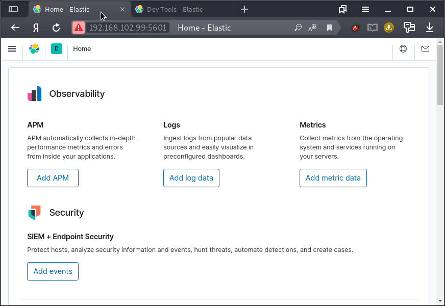
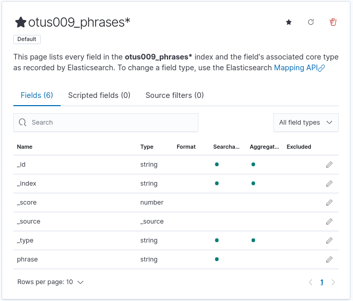
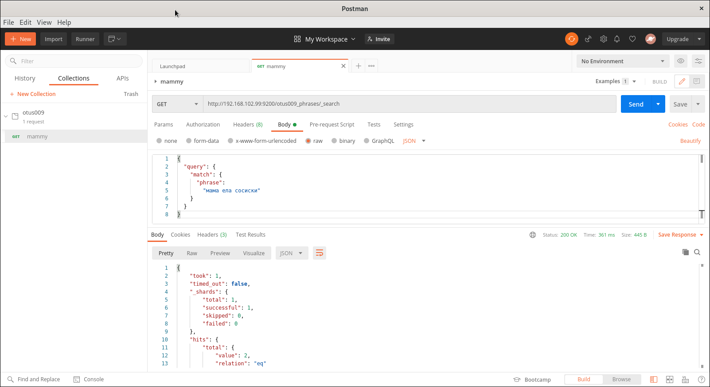

# ElasticSearch

__Цель:__ 
Научитесь разворачивать ES в AWS и использовать полнотекстовый нечеткий поиск

__Задания:__ 
- Развернуть Instance ES – желательно в AWS
- Создать в ES индекс, в нём должно быть обязательное поле text типа string
- Создать для индекса pattern
- Добавить в индекс как минимум 3 документа желательно со следующим содержанием:
    - «моя мама мыла посуду а кот жевал сосиски»
    - «рама была отмыта и вылизана котом»
    - «мама мыла раму»
- Написать запрос нечеткого поиска к этой коллекции документов ко ключу «мама ела сосиски»
- Расшарить коллекцию postman (желательно сдавать в таком формате)
- Прислать ссылку на коллекцию

## 1. Развернуть Instance ES – желательно в AWS

Я использовал `docker-compose.yml` для "Portainer.io" (см. ранее мою заметку о [Portainer](./101_PORTAINER.md)) согласно [https://hub.docker.com/_/elasticsearch](https://hub.docker.com/_/elasticsearch) (Running in Development Mode \ Running in Production Mode) и [https://www.elastic.co/guide/en/elasticsearch/reference/7.5/docker.html](https://www.elastic.co/guide/en/elasticsearch/reference/7.5/docker.html)

```bash
version: '2'
services:
  es01:
    image: docker.elastic.co/elasticsearch/elasticsearch:7.9.3
    restart: always
    container_name: es01
    environment:
      - discovery.type=single-node
    ulimits:
      memlock:
        soft: -1
        hard: -1
    volumes:
      - /media/raid_1_4tb/portainer/data/otus_009/elastic/usr/share/elasticsearch/data:/usr/share/elasticsearch/data
      - /media/raid_1_4tb/portainer/data/otus_009/elastic/usr/share/elasticsearch/logs:/usr/share/elasticsearch/logs
    ports:
      - 9200:9200
    networks:
      - elastic

networks:
  elastic:
    driver: bridge
```


___Заметка___: во время установки возникала ошибка
```bash
.. ElasticsearchException[failed to bind service]; nested: AccessDeniedException
```

так как первоначально необходимо произвости настройку монтируемой локальной директории (см. [это](https://techoverflow.net/2020/04/18/how-to-fix-elasticsearch-docker-accessdeniedexception-usr-share-elasticsearch-data-nodes/) и [это](https://stackoverflow.com/questions/55279515/elasticsearchexception-failed-to-bind-service-error))

```bash
sudo chown -R 1000:1000 /media/raid_1_4tb/portainer/data/otus_009/elastic
```

Проверка работоспособности `http://192.168.102.99:9200/`

```bash
{
  "name" : "68f8a34ec48c",
  "cluster_name" : "docker-cluster",
  "cluster_uuid" : "CxRqvWxhQT2f_J-1nhRzvw",
  "version" : {
    "number" : "7.9.3",
    "build_flavor" : "default",
    "build_type" : "docker",
    "build_hash" : "c4138e51121ef06a6404866cddc601906fe5c868",
    "build_date" : "2020-10-16T10:36:16.141335Z",
    "build_snapshot" : false,
    "lucene_version" : "8.6.2",
    "minimum_wire_compatibility_version" : "6.8.0",
    "minimum_index_compatibility_version" : "6.0.0-beta1"
  },
  "tagline" : "You Know, for Search"
}
```
# 

## 1.2. Развернул Kibana в Docker

Исходя из документации [kibana](https://www.elastic.co/guide/en/kibana/current/docker.html) файл имеет вид `dicker-compose.yml`

```bash
version: '2'
services:
  kibana:
    image: docker.elastic.co/kibana/kibana:7.9.3
    restart: always
    environment:
      ELASTICSEARCH_HOSTS: http://192.168.102.99:9200/
    ports:
      - 5601:5601

```

Работоспособность по адресу `http://192.168.102.99:5601`



___Заметка___: интересно, почему нет докера с комплектом ElasticЫуфкср и Kibana сразу

## 2. Создать в ES индекс, в нём должно быть обязательное поле text типа string

https://www.elastic.co/guide/en/elasticsearch/reference/current/indices-create-index.html

```bash
PUT /otus009_phrases
{
  "mappings": {
    "properties": {
      "phrase": { "type": "text" }
    }
  }
}
```

ответ

```bash
{
  "acknowledged" : true,
  "shards_acknowledged" : true,
  "index" : "otus009_phrases"
}
```

___Заметка___: в Kibana возможно создать шаблон индекса `(Stack Management \ Index Management \ Index Templates)`, содержащий указанные и последующие настройки.


## 3. Создать для индекса pattern

Как я понял паттерны индексов согласно [указанному для Kibana](https://www.elastic.co/guide/en/kibana/current/index-patterns.html)
необходимы для:
- Discover: Интерактивного исследования.
- Visualize: Анализа в диаграммах, таблицах, датчиках, облаках тегов и в ином.
- Canvas: Демонстрации данных в рабочей панели.
- Визуализации данных, имеющих геокоординаты, на картах.

___Вопрос___: Это было проделано с помощью Kibana, но "паттерн индекса" кроме как Kibana (или возможно Postman) нужен кому для осуществления каких-то суперпроизводительных запросов или запросов, упрощающих жизнь?



## 4. Добавить в индекс как минимум 3 документа

Желательно со следующим содержанием:
- «моя мама мыла посуду а кот жевал сосиски»
- «рама была отмыта и вылизана котом»
- «мама мыла раму»

## 5. Написать запрос нечеткого поиска к этой коллекции документов ко ключу «мама ела сосиски»

```bash
GET /otus009_phrases/_search
{
  "query": {
    "match": {
      "phrase": 
        "мама ела сосиски"
    }
  }
}
```

```bash
POST otus009_phrases/_doc/
{
  "phrase": "моя мама мыла посуду а кот жевал сосиски"
}

{
  "_index" : "otus009_phrases",
  "_type" : "_doc",
  "_id" : "d7xShXUBbHgmn5__TYzP",
  "_version" : 1,
  "result" : "created",
  "_shards" : {
    "total" : 2,
    "successful" : 1,
    "failed" : 0
  },
  "_seq_no" : 0,
  "_primary_term" : 1
}

POST otus009_phrases/_doc/
{
  "phrase": "рама была отмыта и вылизана котом"
}

{
  "_index" : "otus009_phrases",
  "_type" : "_doc",
  "_id" : "hrxShXUBbHgmn5__0Yw4",
  "_version" : 1,
  "result" : "created",
  "_shards" : {
    "total" : 2,
    "successful" : 1,
    "failed" : 0
  },
  "_seq_no" : 1,
  "_primary_term" : 1
}

POST otus009_phrases/_doc/
{
  "phrase": "мама мыла раму"
}

{
  "_index" : "otus009_phrases",
  "_type" : "_doc",
  "_id" : "jLxThXUBbHgmn5__Dowd",
  "_version" : 1,
  "result" : "created",
  "_shards" : {
    "total" : 2,
    "successful" : 1,
    "failed" : 0
  },
  "_seq_no" : 2,
  "_primary_term" : 1
}
```

## 6. Расшарить коллекцию Postman (желательно сдавать в таком формате)

```bash
sudo snap install postman
```



## 7. Прислать ссылку на коллекцию

см. [https://www.getpostman.com/collections/6fa5ddcb1b986d42bd47](https://www.getpostman.com/collections/6fa5ddcb1b986d42bd47)

или [](https://app.getpostman.com/run-collection/6fa5ddcb1b986d42bd47)