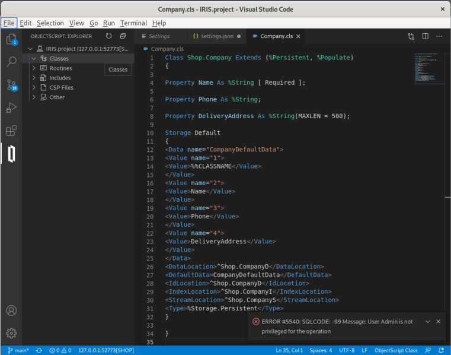
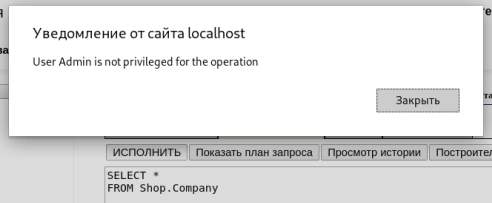
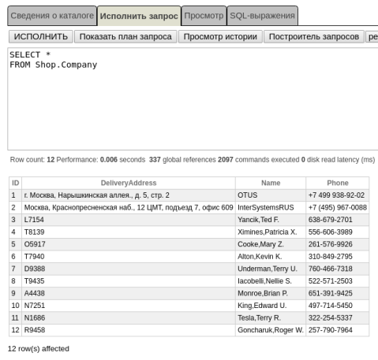
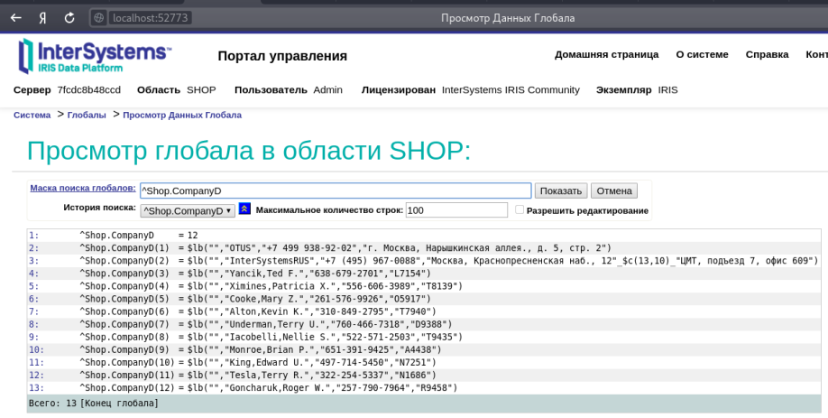
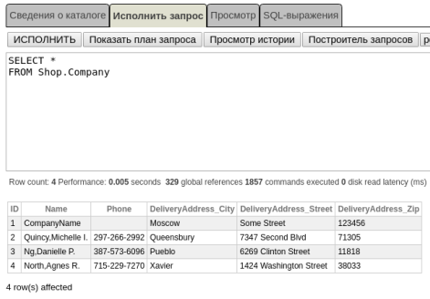
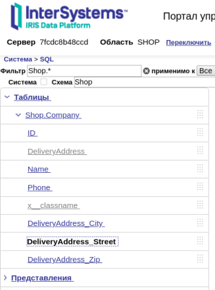
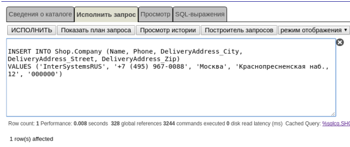
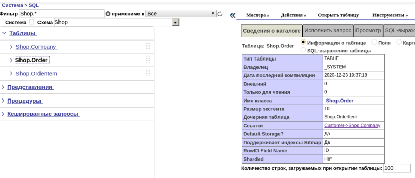
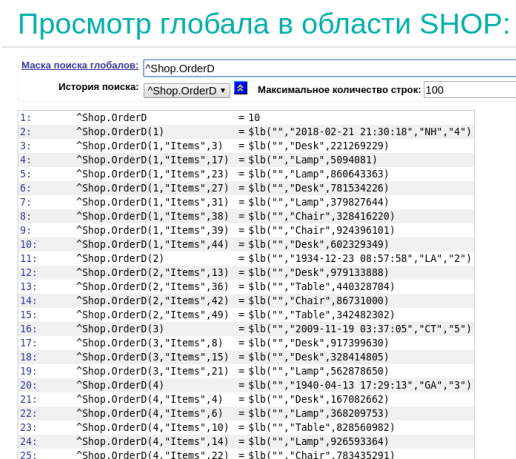
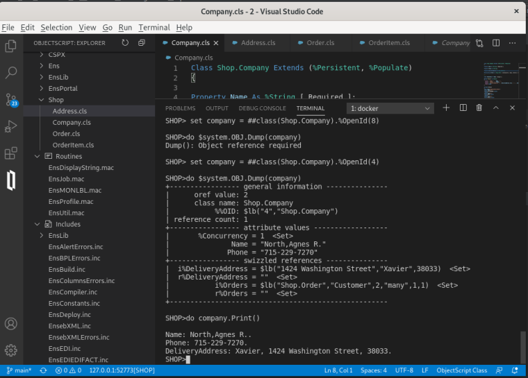

# InterSystems Caché / IRIS

Необходимо:
- развернуть InterSystems Caché / IRIS;
- разработать БД для простейшего магазина с сущностями: заказы, позиции заказа, заказчик (по методичке в материалах занятия).

## Реализация

Исполнено в строгом соответствии с [руководством](./022_INsuTERSYSTEMS.files/ДЗ._Практика_InterSystems_Cache_IRIS-1801-9693d8.pdf)

`IRIS` развернул на локальном Debian в докере.

__ВНИМАНИЕ__:  при создании области в самом конце возникла __ОШИБКА #940: Недостаточно прав для операции__. Последствий обнаружено не было. ДЗ испонено. 

<details> <summary> см. окончание лога </summary> 

```text
Enabling namespace 'SHOP' for Interoperability:
* This instance is not in a mirror
* Mappings
- Class:
 + Adding class mapping Ens -> ENSLIB
 + Adding class mapping EnsLib -> ENSLIB
 + Adding class mapping EnsPortal -> ENSLIB
 + Adding class mapping CSPX.Dashboard -> ENSLIB
- Routine:
 + Adding routine mapping Ens* -> ENSLIB
- Global:
 + Creating new global directory entry for ^EnsDICOM.Dictionary
 + Creating new global directory entry for ^EnsEDI.Description
 + Creating new global directory entry for ^EnsEDI.Schema
 + Creating new global directory entry for ^EnsEDI.X12.Description
 + Creating new global directory entry for ^EnsEDI.X12.Schema
 + Checking/fixing global directory settings for existing global ^IRIS.Msg in directory /usr/irissys/mgr/shop/
 + Checking/fixing global directory settings for existing global ^IRIS.MsgNames in directory /usr/irissys/mgr/shop/
 + Adding global mapping ^EnsDICOM.Dictionary -> ENSLIB
 + Adding global mapping ^EnsEDI.Description("X","X12") -> ENSLIB
 + Adding global mapping ^EnsEDI.Schema("HIPAA_4010") -> ENSLIB
 + Adding global mapping ^EnsEDI.Schema("HIPAA_5010") -> ENSLIB
 + Adding global mapping ^EnsEDI.Schema("ISC_00401") -> ENSLIB
 + Adding global mapping ^EnsEDI.Schema("ISC_00405") -> ENSLIB
 + Adding global mapping ^EnsEDI.X12.Description("HIPAA_4010") -> ENSLIB
 + Adding global mapping ^EnsEDI.X12.Description("HIPAA_5010") -> ENSLIB
 + Adding global mapping ^EnsEDI.X12.Schema("HIPAA_4010") -> ENSLIB
 + Adding global mapping ^EnsEDI.X12.Schema("HIPAA_5010") -> ENSLIB
 + Adding global mapping ^IRIS.Msg("Arial,Tahoma,Verdana") -> ENSLIB
 + Adding global mapping ^IRIS.Msg("Confirm") -> ENSLIB
 + Adding global mapping ^IRIS.Msg("EDIDocumentView") -> ENSLIB
 + Adding global mapping ^IRIS.Msg("Ens") -> ENSLIB
 + Adding global mapping ^IRIS.Msg("EnsAlert") -> ENSLIB
 + Adding global mapping ^IRIS.Msg("EnsBPL") -> ENSLIB
 + Adding global mapping ^IRIS.Msg("EnsColumns") -> ENSLIB
 + Adding global mapping ^IRIS.Msg("EnsDICOM") -> ENSLIB
 + Adding global mapping ^IRIS.Msg("EnsEDI") -> ENSLIB
 + Adding global mapping ^IRIS.Msg("EnsEDIEDIFACT") -> ENSLIB
 + Adding global mapping ^IRIS.Msg("EnsEDIHL7") -> ENSLIB
 + Adding global mapping ^IRIS.Msg("EnsEDISEF") -> ENSLIB
 + Adding global mapping ^IRIS.Msg("EnsEDIX12") -> ENSLIB
 + Adding global mapping ^IRIS.Msg("EnsEnt") -> ENSLIB
 + Adding global mapping ^IRIS.Msg("EnsLDAP") -> ENSLIB
 + Adding global mapping ^IRIS.Msg("EnsMQTT") -> ENSLIB
 + Adding global mapping ^IRIS.Msg("EnsPushNotifications") -> ENSLIB
 + Adding global mapping ^IRIS.Msg("EnsRecordMap") -> ENSLIB
 + Adding global mapping ^IRIS.Msg("EnsSAP") -> ENSLIB
 + Adding global mapping ^IRIS.Msg("EnsSR") -> ENSLIB
 + Adding global mapping ^IRIS.Msg("EnsSearchTable") -> ENSLIB
 + Adding global mapping ^IRIS.Msg("EnsWf") -> ENSLIB
 + Adding global mapping ^IRIS.Msg("EnsXPATH") -> ENSLIB
 + Adding global mapping ^IRIS.Msg("EnsebXML") -> ENSLIB
 + Adding global mapping ^IRIS.Msg("Ensemble") -> ENSLIB
 + Adding global mapping ^IRIS.Msg("ITK") -> ENSLIB
 + Adding global mapping ^IRIS.Msg("RuleEditor") -> ENSLIB
 + Adding global mapping ^IRIS.Msg("Workflow") -> ENSLIB
 + Adding global mapping ^IRIS.Msg("tahoma,verdana") -> ENSLIB
 + Adding global mapping ^IRIS.MsgNames("Arial,Tahoma,Verdana") -> ENSLIB
 + Adding global mapping ^IRIS.MsgNames("Confirm") -> ENSLIB
 + Adding global mapping ^IRIS.MsgNames("EDIDocumentView") -> ENSLIB
 + Adding global mapping ^IRIS.MsgNames("Ens") -> ENSLIB
 + Adding global mapping ^IRIS.MsgNames("EnsAlert") -> ENSLIB
 + Adding global mapping ^IRIS.MsgNames("EnsBPL") -> ENSLIB
 + Adding global mapping ^IRIS.MsgNames("EnsColumns") -> ENSLIB
 + Adding global mapping ^IRIS.MsgNames("EnsDICOM") -> ENSLIB
 + Adding global mapping ^IRIS.MsgNames("EnsEDI") -> ENSLIB
 + Adding global mapping ^IRIS.MsgNames("EnsEDIEDIFACT") -> ENSLIB
 + Adding global mapping ^IRIS.MsgNames("EnsEDIHL7") -> ENSLIB
 + Adding global mapping ^IRIS.MsgNames("EnsEDISEF") -> ENSLIB
 + Adding global mapping ^IRIS.MsgNames("EnsEDIX12") -> ENSLIB
 + Adding global mapping ^IRIS.MsgNames("EnsEnt") -> ENSLIB
 + Adding global mapping ^IRIS.MsgNames("EnsLDAP") -> ENSLIB
 + Adding global mapping ^IRIS.MsgNames("EnsMQTT") -> ENSLIB
 + Adding global mapping ^IRIS.MsgNames("EnsPushNotifications") -> ENSLIB
 + Adding global mapping ^IRIS.MsgNames("EnsRecordMap") -> ENSLIB
 + Adding global mapping ^IRIS.MsgNames("EnsSAP") -> ENSLIB
 + Adding global mapping ^IRIS.MsgNames("EnsSR") -> ENSLIB
 + Adding global mapping ^IRIS.MsgNames("EnsSearchTable") -> ENSLIB
 + Adding global mapping ^IRIS.MsgNames("EnsWf") -> ENSLIB
 + Adding global mapping ^IRIS.MsgNames("EnsXPATH") -> ENSLIB
 + Adding global mapping ^IRIS.MsgNames("EnsebXML") -> ENSLIB
 + Adding global mapping ^IRIS.MsgNames("Ensemble") -> ENSLIB
 + Adding global mapping ^IRIS.MsgNames("ITK") -> ENSLIB
 + Adding global mapping ^IRIS.MsgNames("RuleEditor") -> ENSLIB
 + Adding global mapping ^IRIS.MsgNames("Workflow") -> ENSLIB
 + Adding global mapping ^IRIS.MsgNames("tahoma,verdana") -> ENSLIB
- Updating CPF
- Moving changes to active configuration
 - Loading new mappings for namespace 'SHOP'
* Validating Installation in 'SHOP'
- Checking class 'Ens.Director' ...
- Checking class 'Ens.MessageBody' ...
- Checking class 'Ens.StudioManager' ...
* Creating Interoperability Management Portal
- Not copying legacy CSP pages for portal application
- Configuring portal: /csp/shop [SHOP] using /usr/irissys/csp/shop
- Creating directory: /usr/irissys/csp/shop
- Creating CSP Application: /csp/shop
   Name                 = [/csp/shop]
   AutheEnabled         = [32]
   Enabled              = [1]
   Description          = [Interoperability Management Portal]
   Resource             = [%Ens_Portal]
   AutoCompile          = [0]
   Timeout              = [900]
   Path                 = [/usr/irissys/csp/shop]
   Recurse              = [1]
   LoginPage            = []
   InbndWebServicesEnabled = [1]
   TwoFactorEnabled     = [0]
   IsNameSpaceDefault   = [0]
   PermittedClasses     = []
   MatchRoles           = []
   Type                 = [2]
   CookiePath           = [/csp/shop/]
   LockCSPName          = [1]
   NameSpace            = [SHOP]
   CSPZENEnabled        = [1]
   GroupById            = [%ISCMgtPortal]
   ServeFiles           = [2]
   UseCookies           = [2]
- Removing legacy CSP pages and files from directory '/usr/irissys/csp/shop/'
- Not compiling portal '/csp/shop/' in SHOP as no CSP files were copied
* Adding explicit SQL privileges to Interoperability Roles
- Adding SQL privileges for role '%EnsRole_Administrator'
- Adding SQL privileges for role '%EnsRole_AlertOperator'
- Adding SQL privileges for role '%EnsRole_Developer'
- Adding SQL privileges for role '%EnsRole_Monitor'
- Adding SQL privileges for role '%EnsRole_Operator'
- Adding SQL privileges for role '%EnsRole_RegistryManager'
- Adding SQL privileges for role '%EnsRole_RegistrySelect'
- Adding SQL privileges for role '%EnsRole_RulesDeveloper'
- Adding SQL privileges for role '%EnsRole_WebDeveloper'
* Adding Interoperability SearchTables
- Validating all SearchTable metadata
 - Regenerating metadata for EnsLib.EDI.EDIFACT.SearchTable
 - Regenerating metadata for EnsLib.EDI.X12.SearchTable
 - Regenerating metadata for EnsLib.EDI.XML.SearchTable
 - Regenerating metadata for EnsLib.XML.SearchTable
* Checking for existing named message searches
- No saved message searches found in namespace 'SHOP'; no conversion necessary.
* Checking DocClassMap
   - Added DocClassMap for class 'EnsLib.EDI.EDIFACT.SearchTable' with DOCCLASS 'EnsLib.EDI.EDIFACT.Document'
   - Added DocClassMap for class 'EnsLib.EDI.X12.SearchTable' with DOCCLASS 'EnsLib.EDI.X12.Document'
   - Added DocClassMap for class 'EnsLib.EDI.XML.SearchTable' with DOCCLASS 'EnsLib.EDI.XML.Document'
   - Added DocClassMap for class 'EnsLib.XML.SearchTable' with DOCCLASS 'Ens.StreamContainer'
* Checking for incorrect Timestamp indices
- No UTC index globals need to be repaired.
- Setting initial default Purge Settings
* Building Name index for Ens.Config.Item
* Deleting classes generated from legacy CSP pages
* Generating meta data for Interoperability Analytics items
Importing: Ens/Analytics/ActivityVolumeAndDuration.dashboard

Imported 1 item.
Encountered 0 errors during import.

* Setting new namespace flags
- Enabling SyncCommit for Business Services
* Examining if Interoperability temporary global mapping already configured
ОШИБКА #940: Недостаточно прав для операции
ОШИБКА #940: Недостаточно прав для операции
EnableNamespace Complete.
ОШИБКА #940: Недостаточно прав для операции
```

</details>

Скачал Visual Studio Code для Debian. 

В самои начале при сохранении класса `Company` возникла ошибка. Появлялось исключение о невозможности работы от имени только что созданной при установке учетной записи `системного админа`.



или даже подобное



Не знаю, что конкретно помогло, но возможно то, что через веб-панель добавил прав (применил все):

 `Система` -> `Управление безопасностью` -> `Пользователи` -> `Редактировать пользователя`  -> `(Параметры безопасности)*`
 
Сущность `Company` создалась, но не отображалась в дереве. Рефреш и обновление не помогали. Помогло тольок полное выключение и включение VsCode. Возможно особенность (баг или фича) реализации под Linux.

__ЗАМЕЧАНИЕ__: не ясно, регистрозависимы ли логин и пароль. Как мне показалось, что `admin`, что `Admin` - спокойно авторизовались под одним паролем.

__ЗАМЕЧАНИЕ__ на одной из страниц указано `PHONE> do ##class(Shop.Company).Populate(10)`. Представляется более понятным вариант `SHOP> ...`, так как о `PHONE...`


В целом все задачи были решены, привожу скриншоты и пояснения в соотвествии с номером листа и задачей.

## Основное ДЗ. Раздел 5

### лист 21, пункт 16



### лист 22, пункт 17



### лист 22, пункт 17


## Дополнительное ДЗ. Раздел 6

### лист 26, пункт 3.1, подраздела 6.1



### лист 26, пункт 3.2, подраздела 6.1

Как видно, встаиваемые объекты (%SerialObject) хранятся в целевых таблицах, в которые они собственно и "встраиваются", а не отдельными "сущностями-таблицами".



### лист 26, пункт 3.3, подраздела 6.1

Для вставки значений полей встраиваемых объектов в названиях их свойств необходимо отделять знаком подчеркивания "сущности" встраивамого объекта и ее конкретного "поля".
```sqlite-sql

INSERT INTO Shop.Company (
    Name, 
    Phone, 
    DeliveryAddress_City,    -- <-- От DeliveryAddress отделено City
    DeliveryAddress_Street,  -- <-- От DeliveryAddressо тделено Street о
    DeliveryAddress_Zip      -- <-- От DeliveryAddress отделено Zip
)
VALUES (
    'InterSystemsRUS', 
    '+7 (495) 967-0088', 
    'Москва', 
    'Краснопресненская наб., 12', 
    '000000'
)
```




### лист 29, подпункт 2.1, подраздела 6.4

```text
Изучите, какие таблицы получились, нарисуйте (опишите) структуру
таблиц в любом виде и пришлите ее отчете по ДЗ.
```


Описание:
- `Заказ` (Order) - персистентен и состоит из персистентных `Позиций заказа` (OrderItem)
- `Компания` (Company) - персистентна и содержит встроенную сущность `Адрес` доставки (Address). `Компания` выступает в качестве инициатора `Заказов` (заказчик, Customer).
 
### лист 29, подпункт 2.2, подраздела 6.4

Order



OrderItem


Их состояние



### лист 29, пункт 3, подраздела 6.4



### лист 29, пункт 4, подраздела 6.4

`Продукт` [сделал](./022_INTERSYSTEMS.files/2/Product.cls) персистентным и связял отношением один-ко-многим с [сущностью](./022_INTERSYSTEMS.files/2/OrderItem.cls) `Позиции заказов`

```sqlite-sql
Class Shop.Product Extends (%Persistent, %Populate)
    {
    
    Property Name As %String; -- НАЗВАНИЕ ПРОДУКТА
    
    Property ProductBarCode As %String; -- ШТРИХ-КОД ДЛЯ ПРОБИВА НА КАССЕ
    
    Property Weight As %Integer; -- ВЕС
    
    Property Price As %Integer; -- ЦЕНА
    
    -- УНИКАЛЬНОСТЬ ОПРЕДЕЛЯТЕСЯ ШТРИХ-КОДОМ
    Index ProductBarCodeIndex On ProductBarCode [ Unique ]; 
    
    -- ОДНОЙ ПОЗИЦИИ В ЗАКАЗЕ МОЖЕТ СООТВЕСТВОВАТЬ ТОЛЬКО ОДИН ПРОДУКТ
    Relationship OrdersItems As Shop.OrderItem [ Cardinality = one, Inverse = Product ];
    
    ...
    }

Class Shop.OrderItem Extends (%Persistent, %Populate)
    {
    
    -- ПРОДУКТ МОЖЕТ БЫТЬ В РАЗНЫХ ПОЗИЦИЯХ (У РАЗНЫХ ЗАКАЗОВ СООТВЕСТВЕННО)
    
    Relationship Product As Shop.Product [ Cardinality = many, Inverse = OrdersItems ];
    
    Property Count As %Integer;
    
    Relationship Order As Shop.Order [ Cardinality = parent, Inverse = Items ];
    ...
    }

```
